<!-- ═══════════════════════════════════════════════════════════════════════════ -->
<!--                                                                           -->
<!--   GUILHERME TEIXEIRA — GitHub Profile README                              -->
<!--   Backend Developer | Spring Boot · .NET · PostgreSQL                     -->
<!--                                                                           -->
<!--   Estrutura:                                                              -->
<!--     1. Header animado            (SVG customizado)                        -->
<!--     2. Sobre mim                 (posicionamento)                         -->
<!--     3. Focus Bar                 (SVG animado — áreas de foco)            -->
<!--     4. Tech Stack                (SVG animado — ferramentas)              -->
<!--     5. Métricas GitHub           (stats reais via API)                    -->
<!--     6. Projetos em destaque      (lista curada)                           -->
<!--     7. Contato                   (LinkedIn + email)                       -->
<!--     8. Snake de contribuições    (GitHub Actions)                         -->
<!--                                                                           -->
<!--   Paleta de cores:                                                        -->
<!--     Primária:   #8b5cf6 (roxo)                                            -->
<!--     Secundária: #6366f1 (índigo)                                          -->
<!--     Fundo:      #0d1117 (GitHub dark)                                     -->
<!--     Superfície: #161b22                                                   -->
<!--     Texto:      #e6edf3 / #c9d1d9 / #8b949e                              -->
<!--                                                                           -->
<!--   Para personalizar:                                                      -->
<!--     - Troque 'guilhermedesales' nas URLs de API                           -->
<!--     - Edite os SVGs em /assets para ajustar visual                        -->
<!--     - Snake exige o workflow em .github/workflows/snake.yml               -->
<!--                                                                           -->
<!-- ═══════════════════════════════════════════════════════════════════════════ -->

<!-- ── 1. HEADER ANIMADO ─────────────────────────────────────────────────── -->

  

  

 

<!-- ── 2. SOBRE MIM ──────────────────────────────────────────────────────── -->

  <samp>Backend com foco em Spring, .NET e construção de APIs bem estruturadas.</samp>

 

Estudo **Ciência da Computação** e trabalho como estagiário de desenvolvimento backend.
Meu foco principal é **Spring Boot (Java)**, mas no estágio também atuo com **.NET (C#)** e estou começando a explorar o frontend com **React, Vite e Tailwind**.

O que me move é escrever código que faça sentido — com responsabilidades bem definidas, autenticação pensada desde o início e uma arquitetura que permita o projeto crescer sem virar um problema.

Não me considero especialista. Me considero alguém que estuda com consistência, aplica o que aprende e busca sempre entender o _porquê_ por trás das decisões técnicas.

 

<!-- ── 3. FOCO ───────────────────────────────────────────────────────────── -->
<!--                                                                           -->
<!--   SVG animado com as áreas de foco (backend, auth, clean code, SQL).       -->
<!--   Edite assets/focus-bar.svg para alterar.                                -->
<!--                                                                           -->
<!-- ═════════════════════════════════════════════════════════════════════════ -->

  

 

<!-- ── 4. TECH STACK ─────────────────────────────────────────────────────── -->
<!--                                                                           -->
<!--   SVG animado com mini-ícones inline (compatível com GitHub CSP).          -->
<!--   Edite assets/tech-stack.svg para alterar itens.                         -->
<!--                                                                           -->
<!-- ═════════════════════════════════════════════════════════════════════════ -->

  

 

<h3 align="center">Stack</h3>

 

  

 

<!-- ── 5. MÉTRICAS GITHUB ────────────────────────────────────────────────── -->
<!--                                                                           -->
<!--   Todos os cards usam dados reais do GitHub via API pública.              -->
<!--   Widgets:                                                                -->
<!--     • github-readme-stats — Anurag Hazra (stats + languages)             -->
<!--     • streak-stats — DenverCoder1                                        -->
<!--     • github-readme-activity-graph — Ashutosh00710                       -->
<!--                                                                           -->
<!--   Se os cards não carregarem, pode ser rate-limit do Vercel.             -->
<!--   Nesse caso, faça deploy próprio do github-readme-stats.                -->
<!--                                                                           -->
<!-- ═════════════════════════════════════════════════════════════════════════ -->

  

 

<h3 align="center">Métricas</h3>

 

  
  &nbsp;&nbsp;
  

 

  

 

<!-- Gráfico de atividade de contribuições -->

  

 

<!-- ── 6. PROJETOS EM DESTAQUE ────────────────────────────────────────────── -->

  

 

<h3 align="center">Projetos em Destaque</h3>

 

<table align="center">
  <thead>
    <tr>
      <th>Projeto</th>
      <th>Descrição</th>
      <th>Stack</th>
    </tr>
  </thead>
  <tbody>
    <tr>
      <td>
        <a href="https://github.com/guilhermedesales/janus-back"><b>Janus</b></a>
        &nbsp;·&nbsp;
        <a href="https://github.com/guilhermedesales/janus-front">front</a>
      </td>
      <td>Sistema de gestão de tarefas com autenticação JWT, categorias, status e dashboard analítico</td>
      <td>Spring Boot · React · PostgreSQL · Docker · Vite</td>
    </tr>
    <tr>
      <td>
        <a href="https://github.com/UVAEstudantes/noponto-frontend"><b>NoPonto</b></a>
      </td>
      <td>Sistema de transporte público do Rio com informações em tempo real de linhas, paradas e rotas</td>
      <td>React Native · .NET 9 · PostgreSQL · Expo</td>
    </tr>
  </tbody>
</table>

 

<!-- ── 7. CONTATO ─────────────────────────────────────────────────────────── -->

  

 

<h3 align="center">Contato</h3>

 

  
  &nbsp;
  

 

<!-- ── 8. SNAKE DE CONTRIBUIÇÕES ──────────────────────────────────────────── -->
<!--                                                                           -->
<!--   Gerado automaticamente pelo workflow em .github/workflows/snake.yml     -->
<!--   Os SVGs ficam na branch 'output' do repositório                         -->
<!--                                                                           -->
<!-- ═════════════════════════════════════════════════════════════════════════ -->

  

 

  <picture>
    <source media="(prefers-color-scheme: dark)" srcset="https://raw.githubusercontent.com/guilhermedesales/guilhermedesales/output/github-snake-dark.svg" />
    <source media="(prefers-color-scheme: light)" srcset="https://raw.githubusercontent.com/guilhermedesales/guilhermedesales/output/github-snake.svg" />
    
  </picture>

 

